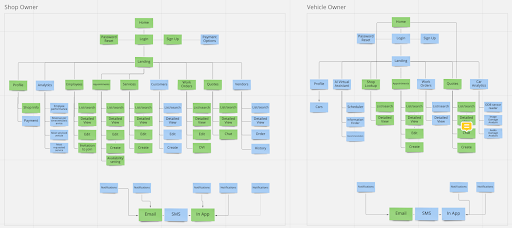
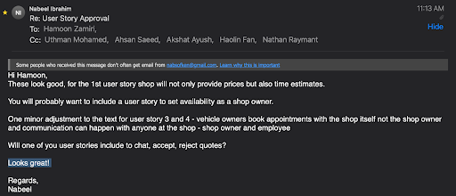

# 'MERN>MEAN' - Team #16 Partner Project with Sayyara

## Table of Contents
<!-- TOC -->
  * [Product Details](#product-details)
    * [Q1: What are you planning to build?](#q1-what-are-you-planning-to-build)
    * [Q2: Who are your target users?](#q2-who-are-your-target-users)
    * [Q3: Why would your users choose your product? What are they using today to solve their problem/need?](#q3-why-would-your-users-choose-your-product-what-are-they-using-today-to-solve-their-problemneed)
    * [Q4: How will you build it?](#q4-how-will-you-build-it)
    * [Q5: What are the user stories that make up the MVP?](#q5-what-are-the-user-stories-that-make-up-the-mvp)
  * [Intellectual Property Confidentiality Agreement](#intellectual-property-confidentiality-agreement)
  * [Process Details](#process-details)
    * [Q6: What are the roles & responsibilities on the team?](#q6-what-are-the-roles--responsibilities-on-the-team)
    * [Q7: What operational events will you have as a team?](#q7-what-operational-events-will-you-have-as-a-team)
    * [Q8: What artifacts will you use to self-organize?](#q8-what-artifacts-will-you-use-to-self-organize)
    * [Q9: What are the rules regarding how your team works?](#q9-what-are-the-rules-regarding-how-your-team-works)
  * [Highlights](#highlights)
<!-- TOC -->

## Product Details
 
### Q1: What are you planning to build?

Project Sayyara aims to create a progressive web app to facilitate the interaction between vehicle owners and automotive repair shop technicians. In its current state, the technology used to find a shop, receive a quote, and book an appointment is decades old, leading to confusion and frustration among customers. This app will streamline the process, presenting users with a shortlist of nearby shops, their availability, and their quotes, making the decision process more straightforward. The app will also provide a platform for easy communication between customers and technicians, as well as ‘owner-oriented’ features (such as the creation of work orders) to improve the workflow within a shop.

To illustrate a use case, consider your typical customer, a vehicle owner, who just had their car break down. As it stands, that customer will have to search for, call, and describe their problem to all nearby repair shops if they want to compare quotes to get the best deal. This may involve sitting on hold, communication issues, along with the myriad of other inconveniences that come with phone-based business. With project Sayyara all of this is bypassed, and the customer gets the exact information they need in the quickest, most comprehensive way possible.

### Q2: Who are your target users?

Target users for this app are auto shop owners, auto shop employees, and vehicle owners/customers who want to use services provided by these shops. In particular, our group of microservices (owner service) are auto shop owners that are looking to use a simple app to manage their work orders, quote delivery, scheduling, and customer interaction.

Take Bob for example, a lifelong car lover and automotive shop owner. He’s getting older, at 56 years old his ability to remember the names of all his customers and the times at which he has appointments is fading from him. Bob has been doing this for over 20 years now and his stacks of paper containing customer records, invoices and more are over 6 feet tall, he knows he cannot keep progressing like this, but he avoids technology at all costs. He knows the basics and uses his computer for personal purposes but now he’s considering implementing a different solution for his paper problem. He wants to use a tool that helps him manage his daily activities at work such as his appointments, his scheduling system, assigning work to employees, seeing what jobs are taking place in his shop and more. Bob also realizes his outreach is limited without the internet and hopes to gain more customers with a simple web application where he can communicate directly with vehicle owners who need a quote for a job they are not sure about. Sayyara is the perfect solution for Bob, as an old fashioned person the simple UI mixed with the resembling features allows for a seamless transition into the technological world for Bob.

### Q3: Why would your users choose your product? What are they using today to solve their problem/need?

The status quo for auto shop owners is answering calls/emails from open to close, going back and forth with customers about availability and the details of their issue, and manually managing appointments, work orders, and quotes. Sayyara would allow shop owners to save considerable organizational time and headache by enabling automated, asynchronous, and standardized interactions with customers. Customers are automatically presented shop availability, quote requests are standardized and easy to read, work orders are integrated with other systems in the platform including scheduling and customer interaction. Communication is streamlined into a web/sms instant messaging inbox. Ultimately Sayyara allows shop owners to forgo the resources and expertise required to develop their own online platform and instead provides an easy to use SaaS platform that’s already connected to a network of customers who are familiar with the service.

### Q4: How will you build it?

The technology stack we’re planning to use is React/TypeScript to design the front end. We will use various libraries for styling and components such as TailwindCSS + TailwindUI. React Router Dom to organize the front end into pages. For the backend we’re using Java Spring/Springboot to develop the apis and organize the application into an MVC pattern using controllers working with our SQL database (postgreSQL). We’ll likely be using hibernate + a mixture of our own SQL queries to access the database.

We’re planning on using JUnit for testing, and will require some mocking from Spring to help with those objects.

To deploy, we’re planning on using Railway to deploy the backend API, and netlify to deploy the frontend web app.

In terms of architecture, we will be coding by feature and following the diagrams laid out below to ensure we capture all functionality required for the web app. Refer also to the mockups for the frontend pages.

### Q5: What are the user stories that make up the MVP?

1. As a shop owner I would like to be able to review quotes and send back prices and time estimates to my clients for potential jobs so that I can give customers an idea for the price without them needing to bring their vehicle in.
2. As a shop owner I would like to be able to schedule appointments with vehicle owners so that they can come in at a dedicated time slot for service on their vehicle.
3. As a vehicle owner I would like to be able to book an appointment with a shop so that I can come in at a dedicated time slot for service on my vehicle.
4. As a customer I would like to be able to send pictures and information about a job to a shop so that I can get a quote before bringing my vehicle into the shop, and I can query several shop owners at the same time.
5. As a shop owner, I would like to be able to set up a profile for myself and my shop so that I can customize features on the website and be available to my clients.
6. As a shop owner or a customer I would like to be able to create an account and login to the website so that I can access the fundamental features provided.
7. As a shop owner I would like to have access to a scheduling system for my appointments so that I can have a detailed view of what is going on in my shop.
8. As a shop owner or customer I would like to be able to reset my password for my account.
9. As a shop owner I would like to be able to have automated emails sent to me and my clients with reminders and appointments, details about previous jobs, and invoices.
10. As a vehicle owner I would like to be able to chat with an employee at a shop to ask any questions or seek help.

Partner approval email:

----
## Intellectual Property Confidentiality Agreement 

The partner chose to follow 3: “You will only share the code under an open-source license with the partner but agree to not distribute it in any way to any other entity or individual.”

----

## Process Details

### Q6: What are the roles & responsibilities on the team?

| Team Member    | Role(s)/Responsibilities                                                                 | Strengths/Weaknesses                                                                                                                             |
|----------------|------------------------------------------------------------------------------------------|--------------------------------------------------------------------------------------------------------------------------------------------------|
| Hamoon Zamiri  | Front-End Developer (main), database design, schema design, modeling and entity creation | Strengths: React, HTML, CSS, Typescript, APIs  Weaknesses: TailwindCSS, advanced CSS, containerization (Docker, Kubernetes), CI/CD Tools |
| Uthman Mohamed | Backend Developer, Scrum Master                                                          | Strengths: Java, PostgreSQL, Testing  Weaknesses: Spring, Hibernate/ORMs, CI/CD Tools                                                    |
| Haolin Fan     | Backend Developer                                                                        | Strengths: Java, C#, Mongo, Postgres, Unity  Weaknesses: Spring Boot, PWA, React, CSS, Typescript                                        |
| Nathan Raymant | Frontend Developer (will help with DB design as needed)                                  | Strengths: React, JS, HTML/CSS, TailwindCSS, CSS animations, SQL, Java  Weaknesses: TypeScript, Spring, containerization                 |
| Akshat Ayush   | Backend Developer                                                                        | Strengths: React, JS, HTML/CSS, PostgreSQL, Java, APIs  Weaknesses: Tailwind, CI/CD tools, containers                                    |
| Ahsan Saeed    | Frontend Developer (Mainly frontend developer, and will assist in backend as needed      | Strengths: React, HTML, CSS, JavaScript/TypeScript, Java  Weaknesses: TailwindCSS, PostgreSQL, CI/CD tools                               |

### Q7: What operational events will you have as a team?

Our current plan is to have recurring team meetings three times a week (Monday, Wednesday, Friday). During these meetings, the members will discuss what progress they’ve made on their respective tasks, resolve any impediments, and discuss potential next steps/tasks the group should tackle. These meetings are to be held online. The team members will constantly be in touch with each other, so if anyone needs urgent clarification or help, informal meetings of subteams would be quickly arranged if necessary.

##### Meetings with project partner:  
Meeting 1: During our first meeting with our project partner, we went over the specifications required for the MVP and discussed how we would go about designing the application. In particular, we went over the three user types expected to use the final product, namely auto shop owners, auto shop employees and vehicle owners, and discussed what each user should be able to do and what features will be available to them in the app. For the MVP, numerous functionalities pertaining to auto shop owners and vehicle owners are expected, with the appointments and quotes features deemed essential.

Meeting 2: Our second scheduled meeting was cancelled due to the partner missing the booked timeslot. Our team discussed and decided to email him the points we wanted to bring up, which would be sufficient and not require a rescheduled meeting. This email is when we informed the partner that we're going to split up with the other 2 teams and work on a separate MVP from them. We outlined our intended scope to work on and asked him to confirm whether he approved it or not. He responded shortly and approved our minimized MVP scope. 

### Q8: What artifacts will you use to self-organize?

We will be using GitHub Projects to manage our tasks. We plan to make this similar to a scrum board and assign tasks to individuals to complete. We will conduct meetings to initially create tasks and order them in terms of priority. Highest priority tasks will be at the top, and whoever is free to take a task can take one from the top, ensuring that we complete tasks in order of priority. If a new task comes up based on a requested feature or discovered bug, a person must create the tasks before starting to work on it so that we can track progress. Columns in the board will be dedicated to stages from inception to completion such as “todo”, “in progress”, “in code review”, “done”. This will help keep track of where certain tasks are in development.

### Q9: What are the rules regarding how your team works?

Our team has decided to use Discord as the primary source of communication. We have two discord servers. One for just our developing team, with a dedicated frontend and backend channel, and another server with the developers and the partner, so that we can have meetings with the partners and make some quick communication if needed. For longer form communication with the partner, we send emails.

We have set up standup meetings to be 3 times a week (Monday, Wednesday, and Friday) to give updates on our progress thus far. We understand that people will not always be able to make it, due to other courses and exams, so we will allow people to miss meetings once in two weeks, but any more than that will require an explanation. Regardless of whether people attend meetings or not, tasks must be completed on a regular basis.

----
## Highlights

A big decision that was made by our team and the other 2 teams that are working with Sayyara was to split off into three different MVPs for the project. We figured that the way the project was setup was not ideal for clearly divided collaboration between the teams, which is what drove us to this decision. We did consider working together but with overlapping schemas and models we decided against this approach. We also considered integration and how that would work with code from 3 teams. It was our belief that it would not make sense to prioritize time on merging 3 pieces of a project instead of having 1 team working on their version with no extra time necessary for integration.

The original scope of the project was chosen under the impression that 3 teams were going to be working on this website full time. With that in mind we decided to shorten the scope of the project drastically, the project was broken down into 3 user groups (shop owners, customers, employees). We’ve decided for our MVP we will not be implementing features related to the employee feature tree as most automotive shop owners will have a pre existing system in place for managing their employees. We’ve decided to focus on shop owner + customer interactions, prioritizing appointment scheduling and quote generating behaviour as this is what seemed the most important to our partner.
