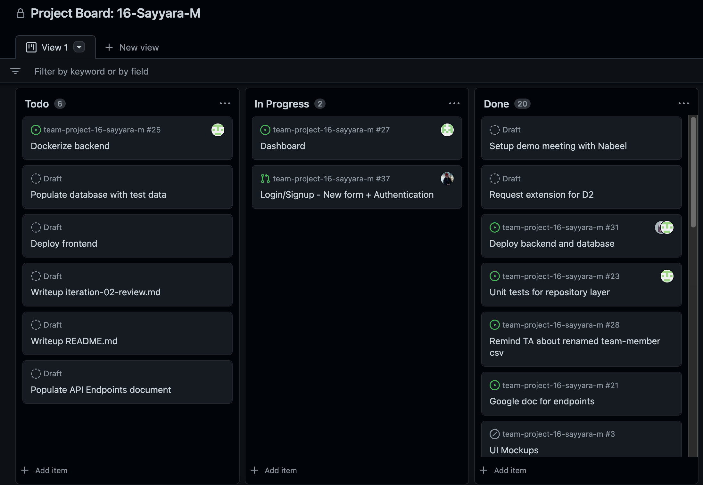
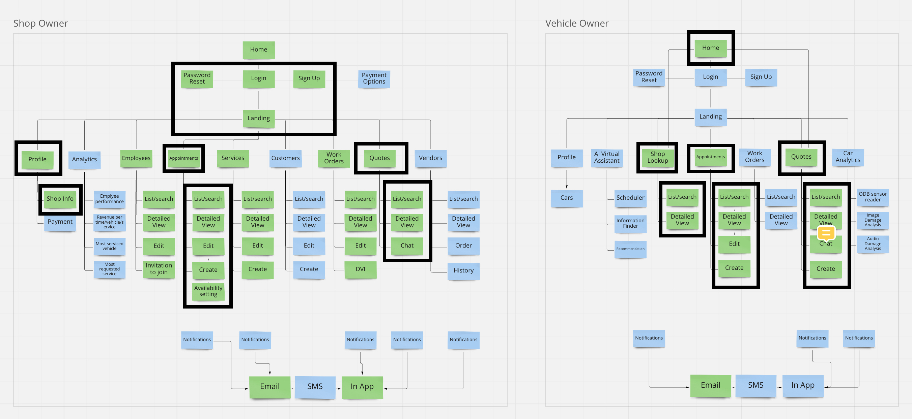

# Sayyara Product Review

## Iteration 02 - Review & Retrospect

* When: Monday November 7th 2022 at 8pm
* Where: Online

## Process - Reflection

### Decisions that turned out well

#### GitHub Project Board
 - Allowed us to efficiently record, organize, and assign tasks
 - Made it easy to visualize what still needed to be done, who was currently working on what, and what was already completed
 

#### Weekly Standup Meetings
- Provided an opportunity for us to collaborate on brainstorming new ideas and tackling challenges
- Kept us accountable and up to date on developments in each teammate's work

#### Miro Board
- Powerful visual overview of all the features that comprise our project 
- Helped us define the scope of our project and user stories

#### Pull Request Rules
(ex: minimum two reviewers)
- Kept each other up to date on changes made by teammates
- Acted as a safety check to catch mistakes

### Decisions that did not turn out as well as we hoped

#### Meetings with partner were not frequent
- Some expectations for certain features were unclear which created development roadblocks 

#### Not prioritizing mockups
- Made it difficult for us integrate separately developed front end features
- Features were developed without an established userflow flow in mind which caused some friction points in our UI

#### Not enough consultation with other members before starting a feature
- Caused challenges in integrating each other's features because development occurred without any defined interfaces

#### Finalizing details of organization and management too late
(ex: exact days and time for standups) a bit later than what would have been ideal
- Resulted in a slow start to our work and as we lacked agreed upon action points and mechanisms for accountability

### Planned changes

1. Try to meet with the partner more frequently, or at least give more updates so they could be a lot more up to date with the progress of the project. At the same time they would be able to help resolve roadblocks related to design expectations and prevent us from heading down the wrong path.

2. Before implementing a feature, consult more thoroughly with others when necessary and/or make a thorough plan. This would make the process of connecting the interfaces of each of our features much cleaner and less time consuming.

3. Definitively divide and assign work during our standups. The stats quo has been loosely establishing what work still remains to be done, adding issues to our project board inidividually, and self-assigning ourselves to tasks following our standups. It would help with accountability if we discussed as a group who will be responsible for which tasks and what expectations we have for each task in terms of scope and deadlines.

## Product - Review

Our product demo with the partner Nabeel was held on **Monday November 7th at 8pm**. To prepare for the meeting, we met up as a team an hour before and discussed who would be presenting what parts, and what were the important points we wanted to get across to get the most relevant feedback. We decided that the most important thing was just to show the frontend pages that we had built, and that the code implementation wouldn't be too relevant. 

We started off with a brief reminder of the scope we aim to cover for the final MVP, as well as what we had covered till this point. Next, each frontend member in our team presented the pages that they worked on. This includes the Login/Signup pages, Profile page, and Shop Owner home page.

Throughout the presentation, we made sure to pause and ask if Nabeel had any questions throughout. He mostly liked what we had built, but gave some suggestions as well.
Some change requests he made were to support Google Chrome autofill form completion for signup/login, add service type field to appointments and quotes, add employee/assigned field to appointments, add approved/viewed field to quotes, and the ability to sort/filter appointments and quotes.

After this demo, we learned that you need to budget much more time than you expect for bringing together everyone’s work and tying up loose ends. In the future, we'll aim to budget the last 2 days on just merging all the code and making sure the product is production-ready before we do the demo.
